# WHATCHANGED

Snap your AWS configs and diff it later.

_dude wheres my config?_

whatchanged is a simple CLI tool I wanted to build in order to quickly check if anything has changed in AWS. 

### Requirements

- [ ] AWS CLI installed and configured

### Install

```bash
go install github.com/csepant/whatchanged@latest
```

### Usage

Store a snapshot of your AWS configuration:
```bash
whatchanged snap
```

Compare the current AWS configuration to the last snapshot:
```bash
whatchanged diff
```

List all snapshots:
```bash
whatchanged list
```


### Architecture

